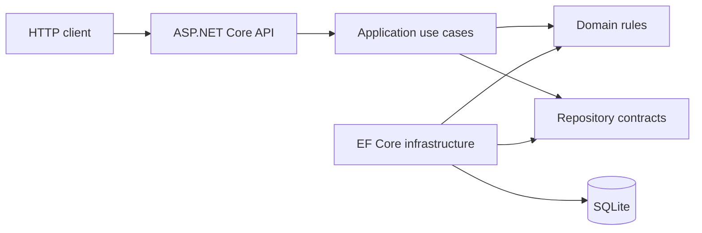
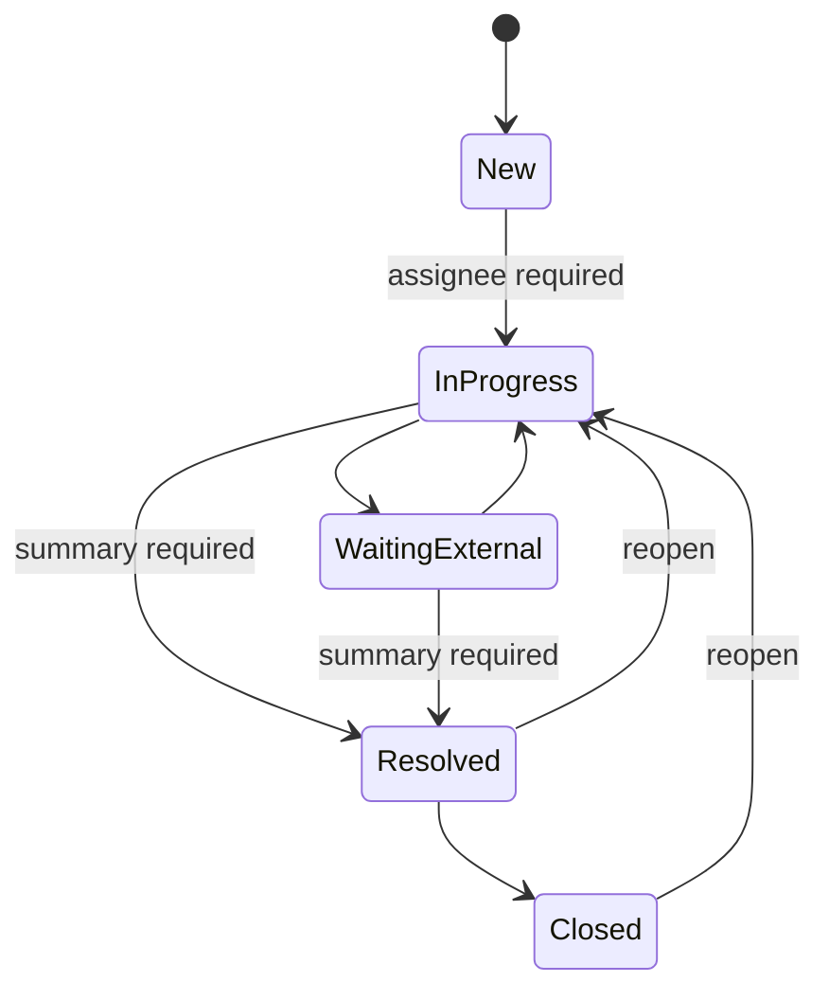

# Transportation Exception Management API

[](https://github.com/Rahulnanduri/transportation-exception-management-api/actions/workflows/ci.yml)

An ASP.NET Core Web API that turns a generic transportation exception workflow into a testable backend system: case intake, filtering, assignment, controlled lifecycle changes, notes, synthetic SLA reporting, and CSV export. The project demonstrates pragmatic layered design, EF Core migrations, SQLite persistence, OpenAPI, integration testing, and CI.

> **Independent portfolio project using deterministic synthetic transportation data.** It contains original code and invented examples only. It was not built for, deployed by, or sourced from an employer, and it makes no production-use or business-impact claim.

## Problem modelled

Transportation work can develop exceptions such as pickup delay, capacity constraint, documentation issue, or route disruption. A useful backend must make those cases visible, assign ownership, enforce understandable state changes, record context, and summarize due-time performance. This API models that generic problem without connecting to a real carrier, customer, or operating network.

The service answers questions such as:

- Which cases are active, overdue, severe, or assigned to a given analyst?
- Is a requested lifecycle transition valid?
- What details and notes belong to a case?
- How do the fabricated cases distribute by status, severity, type, and assignee?
- Which fabricated resolved cases met the invented demonstration thresholds?

## Key capabilities

- Create, list, filter, sort, paginate, and retrieve transportation exception cases.
- Assign work and enforce a domain state machine with `409 Conflict` for invalid transitions.
- Require assignment before `InProgress` and a resolution summary before `Resolved`.
- Add validated case notes and preserve lifecycle timestamps.
- Calculate due times from explicitly synthetic severity thresholds.
- Produce summary and SLA-oriented aggregate reports over synthetic records.
- Export deterministically ordered, correctly escaped CSV data.
- Apply a committed EF Core migration to SQLite and seed exactly 36 deterministic cases into an empty database.
- Publish readable JSON enums, standard `ProblemDetails`, health status, Swagger UI, and OpenAPI JSON.
- Exercise the real HTTP pipeline and SQLite behaviour through xUnit integration tests.

## Architecture



| Layer | Responsibility |
| --- | --- |
| Domain | Entities, enums, field limits, lifecycle transitions, and SLA due-time rules with no HTTP or EF Core dependency. |
| Application | DTOs, filters, pagination, mapping, repository contracts, and use-case services. |
| Infrastructure | EF Core context/configuration, SQLite repository, migration, and deterministic seed process. |
| API | Controllers, dependency injection, validation/error semantics, JSON configuration, health, and Swagger. |
| Tests | API and persistence integration behaviour using SQLite rather than EF Core's InMemory provider. |

The design intentionally avoids MediatR, a generic repository, AutoMapper, and other abstractions that would add ceremony without improving this service. See [docs/architecture.md](docs/architecture.md) for dependency direction and runtime details.

## Technology stack

- C# and .NET SDK `10.0.302` (`net10.0`)
- ASP.NET Core controllers and `ProblemDetails`
- Entity Framework Core `10.0.10`
- SQLite through `Microsoft.EntityFrameworkCore.Sqlite`
- Swashbuckle/OpenAPI
- xUnit and `WebApplicationFactory`
- GitHub Actions on Linux

Direct versions and reproduction assumptions are recorded in [docs/reproducibility.md](docs/reproducibility.md).

## Project structure

```text
TransportationExceptionManagement.sln
├── src/
│   ├── TransportationExceptionManagement.Domain/
│   ├── TransportationExceptionManagement.Application/
│   ├── TransportationExceptionManagement.Infrastructure/
│   └── TransportationExceptionManagement.Api/
├── tests/
│   └── TransportationExceptionManagement.Tests/
├── docs/
│   ├── architecture.md
│   ├── data-model.md
│   ├── reproducibility.md
│   ├── synthetic-data.md
│   ├── api-examples.md
│   └── openapi.json
├── .github/workflows/ci.yml
├── requests.http
├── global.json
└── dotnet-tools.json
```

## Domain workflow



An example lifecycle is: create a fictional case in `New`, assign it to `Analyst-D`, move it to `InProgress`, append a synthetic note, resolve it with a summary, then close it. Invalid edges in the state diagram are rejected as business-state conflicts.

The due-time offsets are invented demonstration values: Critical 2 hours, High 4 hours, Medium 8 hours, and Low 24 hours. They are not real operational standards or copied service commitments.

## API surface

| Method | Route | Purpose |
| --- | --- | --- |
| `GET` | `/health` | Process health check. |
| `GET` | `/api/cases` | Filtered, sorted, paginated case list. |
| `GET` | `/api/cases/{id}` | Case detail with notes and lifecycle fields. |
| `POST` | `/api/cases` | Create a validated case and calculate its synthetic due time. |
| `PATCH` | `/api/cases/{id}/assignment` | Set the fictional assignee. |
| `PATCH` | `/api/cases/{id}/status` | Apply a validated lifecycle transition. |
| `POST` | `/api/cases/{id}/notes` | Append a validated note. |
| `GET` | `/api/cases/export.csv` | Export a filtered case set as CSV. |
| `GET` | `/api/reports/summary` | Aggregate counts and active/overdue totals. |
| `GET` | `/api/reports/sla` | Demonstration due-time outcomes over synthetic cases. |

`GET /api/cases` supports `status`, `severity`, `exceptionType`, `assignee`, `origin`, `destination`, `createdFrom`, `createdTo`, `page`, `pageSize`, `sortBy`, and `sortDirection`. Sort fields are explicitly whitelisted.

## Example request

```bash
curl --request POST http://localhost:5234/api/cases \
  --header "Content-Type: application/json" \
  --data '{
    "caseReference": "CASE-DEMO-1001",
    "movementReference": "MOV-DEMO-1001",
    "originNode": "NODE-A",
    "destinationNode": "DC-EAST",
    "carrierCode": "CARRIER-04",
    "exceptionType": "RouteDisruption",
    "severity": "High",
    "description": "Synthetic route disruption created for API demonstration."
  }'
```

A valid request returns `201 Created` and a `Location` header for the new detail resource. The response uses camel-case JSON and readable enum strings. See [docs/api-examples.md](docs/api-examples.md) or run the sequences in [requests.http](requests.http) for filters, assignment, transitions, notes, reports, and CSV.

## Run locally

### Prerequisites

- Stable .NET 10 SDK compatible with `global.json`; the documented baseline is `10.0.302`.
- Git.
- No database server, external API, credential, or employer dataset is required.

### Setup

```bash
git clone https://github.com/Rahulnanduri/transportation-exception-management-api.git
cd transportation-exception-management-api
dotnet tool restore
dotnet restore TransportationExceptionManagement.sln
dotnet run --project src/TransportationExceptionManagement.Api
```

The Development launch profile listens on `http://localhost:5234`. On first startup, EF Core applies pending migrations, creates the ignored local SQLite database, and inserts the deterministic seed only when the cases table is empty.

### Migrations

The committed `InitialCreate` migration is the schema source of truth; the application does not use `EnsureCreated` as its database strategy. To apply migrations explicitly:

```bash
dotnet ef database update \
  --project src/TransportationExceptionManagement.Infrastructure \
  --startup-project src/TransportationExceptionManagement.Infrastructure \
  --connection "Data Source=transportation-exceptions.db"
```

Use an absolute path in the connection string when the database location matters; relative design-time paths are resolved from the startup project.

Generated database files are intentionally excluded from source control.

## Test and quality checks

```bash
dotnet restore TransportationExceptionManagement.sln
dotnet format TransportationExceptionManagement.sln --verify-no-changes --no-restore
dotnet build TransportationExceptionManagement.sln --configuration Release --no-restore
dotnet test TransportationExceptionManagement.sln --configuration Release --no-build
dotnet list TransportationExceptionManagement.sln package --vulnerable --include-transitive
```

Tests verify observable behaviour rather than scaffold construction: health, seeded listing, pagination/filtering, detail/404 responses, validation, creation, assignment, lifecycle conflicts, notes, reports, CSV, and migration-backed persistence.

## CI

The `CI` GitHub Actions workflow runs on pull requests and pushes to `main`. It restores dependencies, verifies formatting, builds in Release, executes the test suite, and launches the built API against a temporary SQLite file. A bounded retry loop requires successful `/health` and `/swagger/v1/swagger.json` responses and always stops the background process.

The badge reflects GitHub's latest workflow result; this README does not substitute a claimed result for the actual run log.

## Swagger and OpenAPI

With the API running in Development:

- Swagger UI: `http://localhost:5234/swagger`
- OpenAPI JSON: `http://localhost:5234/swagger/v1/swagger.json`

The repository snapshot at `docs/openapi.json` is captured from the genuinely running application, not hand-authored. Regenerate and review it whenever the public contract changes.

## Synthetic-data and privacy boundary

The 36 seeded cases are generated from fixed fictional references, nodes, carrier labels, analysts, timestamps, categories, and notes. Seed execution does not use a network or current-time input. Full methodology is in [docs/synthetic-data.md](docs/synthetic-data.md).

This repository contains no employer source code, URLs, terminology, procedures, credentials, customer/carrier records, site data, or confidential metrics. Do not add real operational or personal data to local databases, logs, screenshots, issues, or pull requests.

## Limitations

- No authentication or authorization; the API is for local evaluation and automated testing.
- SQLite and a single process are not a claim of distributed scale or production readiness.
- No real carrier/customer integration, notification channel, frontend, or production telemetry.
- Startup migration is convenient for a portfolio demonstration; controlled deployments normally separate schema promotion.
- SLA rules and report values are illustrative and do not validate a real transportation policy.
- Timestamps are UTC; richer locale/time-zone presentation is outside this backend scope.
- The API does not currently implement optimistic concurrency or audit identities.

## Potential next improvements

If the project needed to move beyond its current demonstration scope, valuable next steps would be authenticated roles, optimistic concurrency, PostgreSQL support, structured operational telemetry, and contract/version compatibility tests. Those additions should follow a concrete requirement rather than be added only for architectural appearance.

## Licence

Original project code and synthetic seed definitions are available under the [MIT License](LICENSE). No third-party or employer dataset is included or licensed by this repository.
