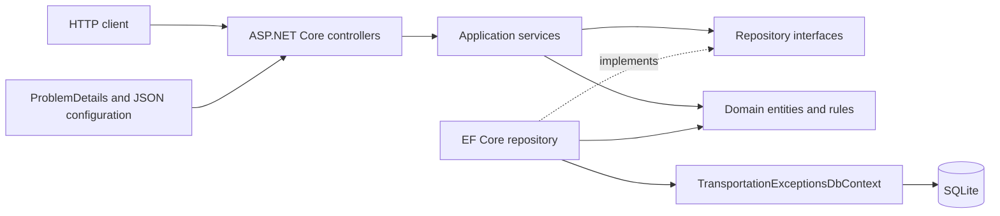
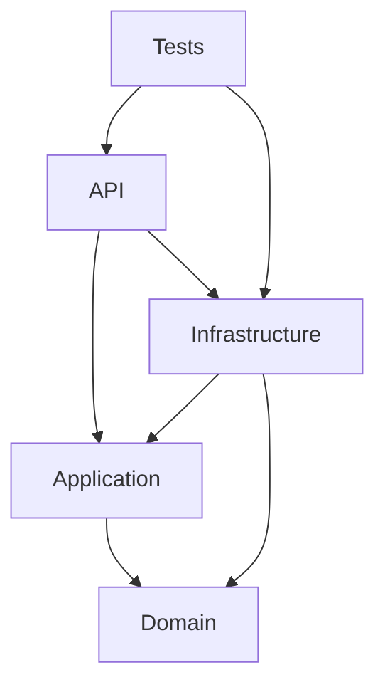

# Architecture

## Context

Transportation Exception Management is an independent portfolio API that models a generic workflow for recording, assigning, progressing, and reporting transportation exceptions. The application deliberately uses fictional concepts and deterministic synthetic data. It is not an implementation of an employer system or operating procedure.

The solution uses a small layered architecture: each project has a clear responsibility, while the design stays compact enough for a single-service demonstration.

## Runtime flow

At startup, the API composes the application and infrastructure layers through dependency injection. Controllers accept HTTP DTOs and delegate use cases to application services. Repository interfaces keep application logic independent of EF Core, while the infrastructure implementation translates the requested filters and updates into parameterized LINQ queries against SQLite.

## Projects and responsibilities

| Project | Responsibility |
| --- | --- |
| `TransportationExceptionManagement.Domain` | Entities, enums, lifecycle rules, and domain invariants. It has no HTTP or EF Core dependency. |
| `TransportationExceptionManagement.Application` | Request/response DTOs, query and pagination models, mappings, service interfaces, and use-case orchestration. |
| `TransportationExceptionManagement.Infrastructure` | EF Core `DbContext`, entity configuration, repository implementation, migrations, SQLite registration, and deterministic seed data. |
| `TransportationExceptionManagement.Api` | Controllers, dependency injection, HTTP validation/error semantics, enum JSON configuration, health endpoint, and Swagger/OpenAPI. |
| `TransportationExceptionManagement.Tests` | API and persistence integration tests using the real HTTP pipeline and SQLite persistence. |

## Dependency direction

The domain is the dependency root. Application code depends on domain concepts but not on ASP.NET Core or EF Core. Infrastructure implements application contracts. The API is the composition root and is the only project that knows which concrete infrastructure implementation is used.

## Request lifecycle

1. ASP.NET Core binds and validates a request DTO.
2. A controller calls the relevant application service with a cancellation token.
3. The service applies domain rules and requests persistence through a repository interface.
4. EF Core executes parameterized queries and commits the unit of work to SQLite.
5. The service maps entities to response DTOs; controllers return the appropriate HTTP status.
6. Validation failures and unavailable resources use standard 4xx responses. Invalid lifecycle transitions use `409 Conflict` with `ProblemDetails`.

Read queries support explicit filter fields and a whitelist of sortable columns. User input is never interpolated into raw SQL.

## Persistence and startup

SQLite keeps the local setup lightweight and makes integration testing realistic without requiring a database server. A committed EF Core migration defines the schema. During local portfolio startup, the API applies pending migrations and seeds deterministic cases only when the database contains no cases. Generated `.db`, write-ahead-log, and shared-memory files are excluded from Git.

Automatic startup migration is convenient for this self-contained demonstration. A production deployment would normally separate schema promotion from application startup and apply an environment-specific review and rollback process.

## Cross-cutting choices

- Nullable reference types, implicit usings, warnings-as-errors, and deterministic compilation are enabled centrally.
- Enums are serialized as readable strings.
- DTOs prevent EF Core entities from becoming the public HTTP contract.
- Async database and HTTP paths accept cancellation where practical.
- `ProblemDetails` provides machine-readable errors without exposing exception details.
- Swagger is exposed in the Development environment; the committed OpenAPI snapshot is captured separately from a running application.
- The API has no authentication or authorization. It is intended for local portfolio evaluation, not internet deployment.

## Deliberate scope limits

The repository is a backend engineering demonstration, not a production transportation platform. It contains no carrier integrations, message broker, distributed cache, frontend, cloud infrastructure, or employer-specific workflow. SQLite and a single API process are appropriate for the reproducible local scope, but not a claim of horizontal scalability.
