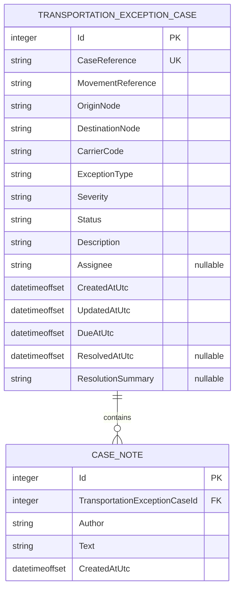
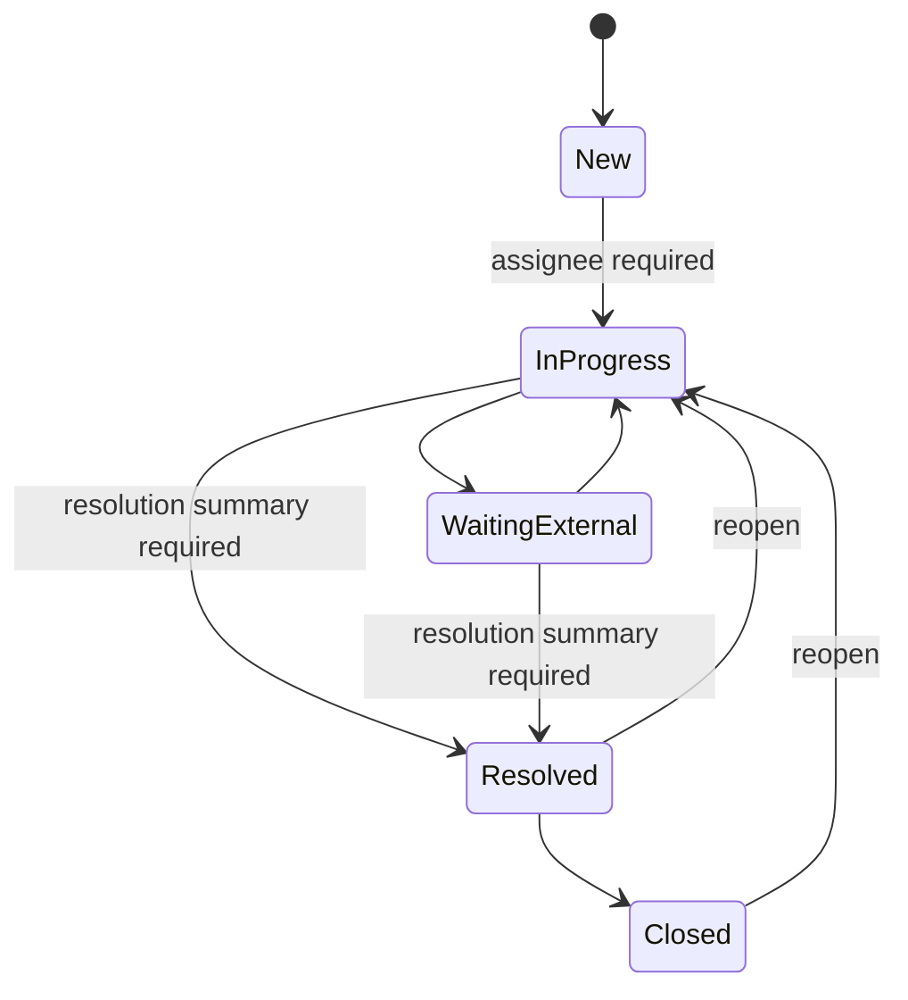

# Data model

The persistence model contains transportation exception cases and their notes. All examples and seeded records are synthetic.

## Entity relationship

One case can contain zero or more notes. Each note belongs to exactly one case and is removed with its parent according to the EF Core relationship configuration.

EF Core stores enum values as readable strings. UTC `DateTimeOffset` values are converted to Unix-millisecond integers so SQLite can compare and sort them consistently, then materialized back as UTC offsets in the domain model.

## `TransportationExceptionCase`

| Field | Meaning |
| --- | --- |
| `Id` | Database identity used by case-detail and command routes. |
| `CaseReference` | Stable human-readable identifier such as `CASE-0001`; unique in the database. |
| `MovementReference` | Fictional movement identifier such as `MOV-0001`. |
| `OriginNode`, `DestinationNode` | Generic route endpoints. A case is invalid when they are identical. |
| `CarrierCode` | Fictional carrier label, never a real carrier account or record. |
| `ExceptionType` | Generic category describing the exception. |
| `Severity` | Illustrative urgency level used to calculate the due timestamp. |
| `Status` | Current lifecycle state. |
| `Description` | Concise synthetic problem statement. |
| `Assignee` | Optional fictional analyst label. Required before entering `InProgress`. |
| `CreatedAtUtc`, `UpdatedAtUtc` | Auditable UTC lifecycle timestamps. |
| `DueAtUtc` | Created time plus the synthetic severity threshold. |
| `ResolvedAtUtc` | Set when the case enters `Resolved`; cleared when it is reopened. |
| `ResolutionSummary` | Required when resolving; cleared when a resolved or closed case is reopened. |

## `CaseNote`

`CaseNote` records a small append-only narrative associated with a case. `Author` and `Text` are required and length-limited. The author is a fictional display label, not an authenticated identity.

## Enumerations

### Exception type

- `PickupDelay`
- `DeliveryRisk`
- `CapacityConstraint`
- `DocumentationIssue`
- `EquipmentIssue`
- `RouteDisruption`

### Severity

- `Low`
- `Medium`
- `High`
- `Critical`

### Status

- `New`
- `InProgress`
- `WaitingExternal`
- `Resolved`
- `Closed`

The API serializes these values as strings. Unknown enum text is rejected during request binding rather than silently converted.

## Lifecycle constraints

Other transitions are rejected as conflicts. Reopening returns a case to active handling and updates its lifecycle timestamps.

## Illustrative SLA calculation

| Severity | Demonstration target |
| --- | ---: |
| `Critical` | 2 hours |
| `High` | 4 hours |
| `Medium` | 8 hours |
| `Low` | 24 hours |

These values are invented for this portfolio project. They are not real carrier commitments, employer standards, copied escalation thresholds, or operational advice.
